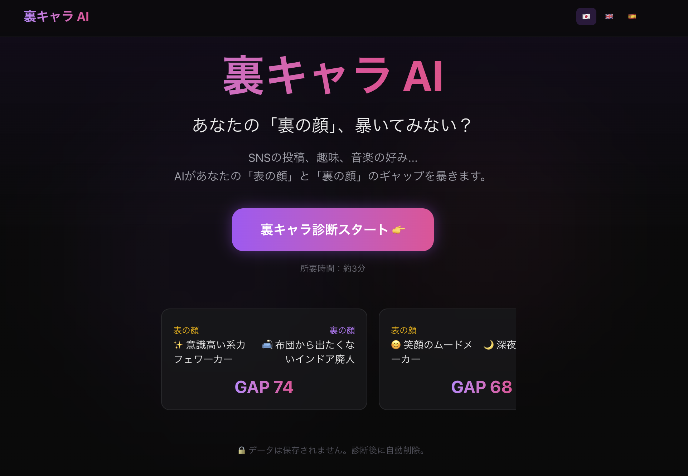

# UraChara AI

あなたの「裏キャラ」、暴いちゃいます。

SNS投稿・趣味・スケジュール・音楽の好み・第一印象を入力すると、AIが「表の顔」と「裏の顔」のギャップを分析するエンタメ性格診断アプリです。



## Features

- 5つの入力カテゴリから表の顔と裏の顔を AI が分析
- 5軸（社交性・行動力・感受性・論理性・自己主張）のスコアリング
- ギャップスコア（0-100）と5段階のギャップレベル判定
- リアルタイムの分析フェーズ表示（SSE ストリーミング）
- シェアカード生成（画像 + Twitter/X 共有テキスト）
- 多言語対応（日本語・英語・スペイン語）

## Tech Stack

| カテゴリ | 技術 |
|---|---|
| フレームワーク | Next.js 16 (App Router) |
| 言語 | TypeScript (strict mode) |
| スタイリング | Tailwind CSS 4 |
| アニメーション | Framer Motion |
| AI | Anthropic Claude API (claude-sonnet-4-6) |
| Lint / Format | Biome |
| デプロイ | Vercel |

## Getting Started

### 前提条件

- Node.js 20+
- npm
- Anthropic API キー

### セットアップ

```bash
# リポジトリのクローン
git clone https://github.com/Ken-Miyamura/ura-chara-ai.git
cd ura-chara-ai

# 依存関係のインストール
npm install

# 環境変数の設定
cp .env.example .env.local
# .env.local に ANTHROPIC_API_KEY を設定

# 開発サーバーの起動
npm run dev
```

[http://localhost:3000](http://localhost:3000) をブラウザで開く。

### npm scripts

| コマンド | 説明 |
|---|---|
| `npm run dev` | 開発サーバー起動 |
| `npm run build` | プロダクションビルド |
| `npm run start` | プロダクションサーバー起動 |
| `npm run lint` | Biome による lint チェック |
| `npm run lint:fix` | Biome による lint 自動修正 |
| `npm run format` | Biome によるフォーマット |

## Project Structure

```
src/
├── app/
│   ├── [locale]/          # i18n ルーティング
│   │   ├── page.tsx       # ランディングページ
│   │   ├── input/         # 入力フォーム
│   │   ├── analyzing/     # 分析中アニメーション
│   │   ├── result/        # 結果表示
│   │   └── share/         # シェアカード
│   └── api/
│       └── analyze/       # Claude API 呼び出し (POST, SSE)
├── components/            # UI コンポーネント
├── hooks/                 # カスタムフック (useAnalysis)
├── i18n/                  # 多言語リソース (ja/en/es)
├── lib/                   # ユーティリティ・定数・バリデーション
├── prompts/               # Claude 用システムプロンプト・分析プロンプト
└── types/                 # 型定義 (shared.ts が single source of truth)
```

## Architecture

### データフロー

```
ユーザー入力 → バリデーション → Claude API (tool-use) → レスポンスパース → SSE → クライアント
```

- **tool-use パターン**: Claude に `submit_analysis_result` ツールを呼ばせることで、構造化 JSON レスポンスを保証
- **クライアントサイド完結**: MVP ではデータベースなし。全状態はクライアント側で管理
- **レート制限**: IP ベースで 10 分あたり 5 リクエスト

### 分析ロジック

5つの入力から「表の顔」と「裏の顔」を導出:

| 入力 | 表の顔への寄与 | 裏の顔への寄与 |
|---|---|---|
| SNS投稿 | トーン・言葉遣いから自己演出を読む | 微妙な言語的手がかりを深読み |
| 趣味 | ソロ/グループ、アクティブ/インドアの分類 | 矛盾する行動パターンの検出 |
| スケジュール | - | 実際の時間配分と表の顔のギャップ |
| 音楽 | - | 感情面・内面のシグナル |
| 第一印象 | 他者からの印象をアンカーに | 自己認識と実データの乖離 |

SNS をやっていないユーザーは「やらない理由」を入力でき、それ自体を性格シグナルとして分析します。

## Development Flow

### ブランチ戦略

- `main` — プロダクションブランチ
- `feature/*` — 新機能
- `fix/*` — バグ修正

### コミット規約

[Conventional Commits](https://www.conventionalcommits.org/) に準拠:

```
feat(scope): 新機能の追加
fix(scope): バグ修正
docs(scope): ドキュメントの変更
refactor(scope): リファクタリング
```

### PR フロー

1. feature/fix ブランチを作成
2. 変更を実装
3. `npm run lint` + `npm run build` で確認
4. Draft PR を作成 → レビュー → main にマージ

## Docs

詳細な設計ドキュメントは `docs/` にあります:

- [docs/product-design.md](docs/product-design.md) — プロダクト仕様
- [docs/technical-architecture.md](docs/technical-architecture.md) — 技術設計

## Environment Variables

| 変数名 | 必須 | 説明 |
|---|---|---|
| `ANTHROPIC_API_KEY` | Yes | Anthropic API キー |

## License

Private
